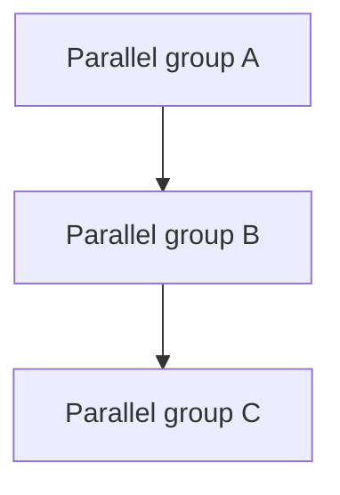

# Harness skill

You are the **lead agent** for a sprint. You do not implement features yourself unless a subagent failed twice; you orchestrate implement → verify → review → close per task.

## Inputs

- Sprint ID (e.g. `S001`) from `/run-sprint` or user
- `.ai/planning/tasks.md` — all tasks for the sprint
- `.ai/context/TECHSPEC.md` — stack and constraints
- `.ai/planning/sprints.md` — sprint status

## Task format (parse from tasks.md)

Each task block includes:

- `## T[id] — [title]`
- **Sprint**, **Milestone**, **Status**, **Mode** (`AFK` | `HITL`), **Parallel group**, **Blocked by**, **Branch**
- Slice objective, layers, acceptance criteria, out of scope, context, definition of done

Status values: `todo` | `in-progress` | `blocked` | `done`

## Dependency graph

1. Filter tasks where **Sprint** matches the active sprint ID
2. Exclude `done` tasks
3. Group by **Parallel group** (A, B, C, D…)
4. Within a group, tasks are runnable in parallel if:
   - Status is `todo` or `blocked` only because upstream isn't done — re-evaluate after each group completes
   - **Blocked by** is `none` OR every listed task ID is `done`
   - **Mode** is `AFK` — skip `HITL` tasks until user confirms checkpoint (mark `blocked` with reason if needed)
5. Order groups alphabetically: run all eligible tasks in A, then B, etc.



## Per-task pipeline

For each runnable task, run this pipeline (use subagents / Build in Parallel within a group):

| Step | Skill | On fail |
|------|-------|---------|
| 1 | `implement` | Retry implement once with failure context |
| 2 | `verify` | Back to implement (revision cycle 1) |
| 3 | `review` (Phase 1 task fit + Phase 2 thermo-nuclear) | Back to implement (revision cycle 1) |
| 4 | `close` | If PR fails, report blocked |

**Revision loop:** max **2** full cycles (implement → verify → review). After 2 failures, set task **Status** to `blocked`, note reason in task block, continue other tasks if any.

## Dispatching subagents

- For parallel group with N tasks, launch **N subagents in parallel** (Cursor Build in Parallel)
- Each subagent gets: task ID, branch name, path to task section in `tasks.md`, TECHSPEC path
- Subagent sequence per task: implement → verify → review → close (or harness coordinates steps if single agent per task)

Prompt template for subagent:

```text
Execute Factory task [Txxx] for sprint [Sxxx].
Read task spec in .ai/planning/tasks.md (section ## Txxx).
Follow .ai/context/TECHSPEC.md and .cursor/rules.
Branch: [branch from task].
Run skills in order: implement, verify, review (includes thermo-nuclear maintainability), close.
Return: status (done|blocked), PR URL if any, summary.
```

## Updating tasks.md

After each task state change, edit `.ai/planning/tasks.md`:

- Starting work: `Status: in-progress`
- Success after close: `Status: done`
- Failure after 2 cycles: `Status: blocked` + add bullet under task: `**Blocker:** [reason]`

When a task becomes `done`, scan tasks in later parallel groups and clear implicit blocks (harness re-evaluates **Blocked by**).

## Sprint completion

When all sprint tasks are `done` or only `blocked` remain with no runnable work:

1. Update `.ai/planning/sprints.md` — set sprint **Status** to `done` (or `blocked` if any critical task blocked)
2. Invoke **retro** skill (or instruct user to run diary update): append `.ai/logs/diary.md`
3. Report summary:

```markdown
## Sprint [Sxxx] complete

| Task | Status | PR |
|------|--------|-----|
| T001 | done | #url |

**Blocked:** [list or none]
**Next:** /run-sprint S00y or /milestone-review M00x
```

## Rules

- Never push to `staging` or `main`
- Task PRs target `dev` only
- Do not expand scope beyond task acceptance criteria
- Prefer parallel execution over serial when groups allow

## Skills referenced

- `skills/harness/implement/SKILL.md`
- `skills/harness/verify/SKILL.md`
- `skills/harness/review/SKILL.md` (Phase 2: `skills/harness/thermo-nuclear-code-quality-review/SKILL.md`)
- `skills/harness/close/SKILL.md`
- `skills/harness/retro/SKILL.md` (end of sprint)
