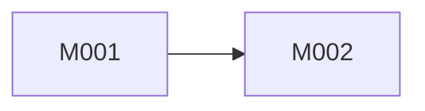

# Milestones

> Ordered deliveries. Each milestone groups one or more sprints.

---

## Vision

[One paragraph: what the product becomes when all milestones below are done.]

---

## Milestone overview

| ID | Title | Outcome | Depends on | Status |
|----|-------|---------|------------|--------|
| M001 | [Name] | [User-visible outcome] | — | planned |
| M002 | [Name] | [Outcome] | M001 | planned |

---

## M001 — [Milestone title]

**Outcome:** [What users can do when M001 is complete.]

**Sprints in this milestone:**

| Sprint | Goal | Tasks (high level) |
|--------|------|-------------------|
| S001 | [Goal] | T001, T002, T003 |
| S002 | [Goal] | T004, T005 |

**Dependencies:** none (or M00x)

**Definition of done (milestone):**

- [ ] All sprints in M001 marked done in `tasks.md`
- [ ] `/milestone-review M001` passed (CI gates green)
- [ ] `dev → staging` PR approved by human

---

## M002 — [Milestone title]

**Outcome:** [Outcome]

**Sprints in this milestone:**

| Sprint | Goal | Tasks |
|--------|------|-------|
| S003 | [Goal] | T006, … |

**Dependencies:** M001

---

## Sprint ↔ task mapping

See `.factory/planning/sprints.md` for sprint schedule and `.factory/planning/tasks.md` for atomic tasks.

---

## Dependency graph (milestones)

